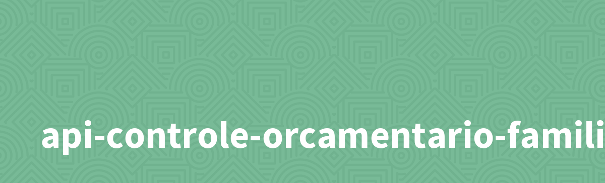

## Challenge BackEnd - 4° Edição  - API

> 📝 **Projeto**:  API Rest de uma aplicação de controle financeiro.

## ❔ História
Após alguns testes com protótipos feitos pelo time de UX de uma empresa, foi requisitada a primeira versão de uma aplicação para **controle de orçamento familiar**. A aplicação deve permitir que uma pessoa cadastre suas receitas e despesas do mês, bem como gerar um relatório mensal.

Os times de frontend e UI já estão trabalhando no layout e nas telas. Para o back-end, as principais funcionalidades a serem implementadas são:

API com rotas implementadas seguindo as boas práticas do modelo REST;
Validações feitas conforme as regras de negócio;
Implementação de base de dados para persistência das informações;
Serviço de autenticação/autorização para restringir acesso às informações.

## Funcionalidades

### Semana 1

- [x] Bando de dados dos modelos de Receita e Despesa
- [x] CRUD dos modelos
- [ ] Autenticação

## Regras de Negócios

* Todas as informações da *receita* e *despesas* são obrigatórias
* A API não deve permitir o cadastro de receitas e despesas duplicadas(contendo a mesma descrição, dentro do mesmo mês)

| Tecnologias | Version |
|-------------|---------|
| Python      | 3.9.5   |
| Flask       | 2.2.1   |
| MySQL       | 8.0     |

    
## Dependências

    pip install -r requirements.txt

## Status do Projeto

**Status**: Em progresso

#alura  
#alura-chellange  
#backend